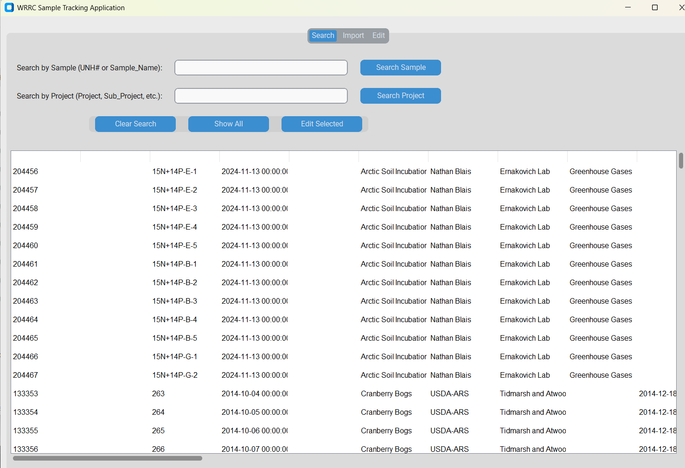
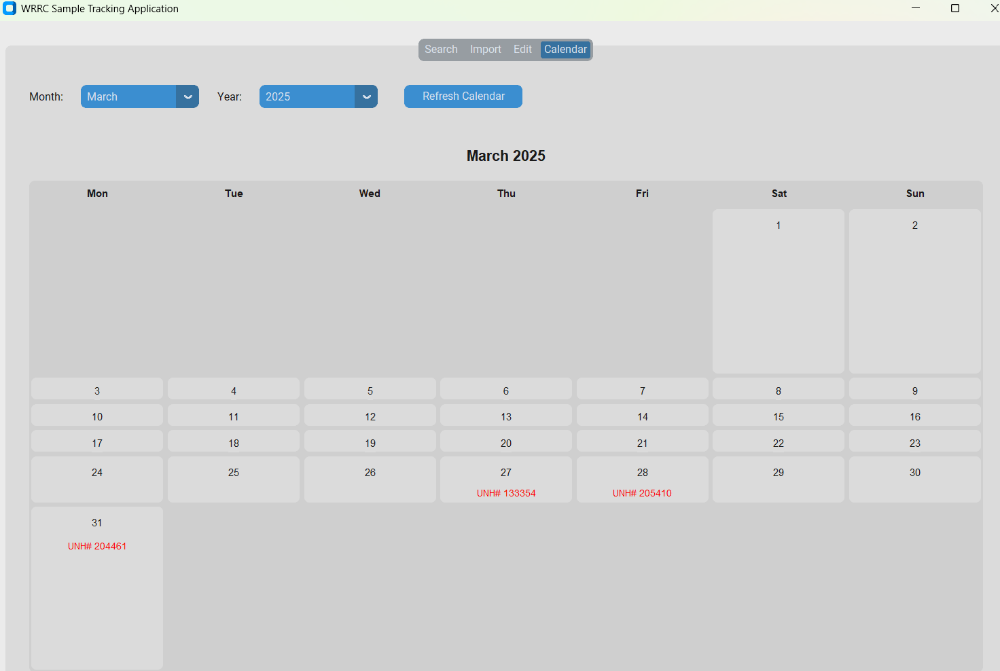
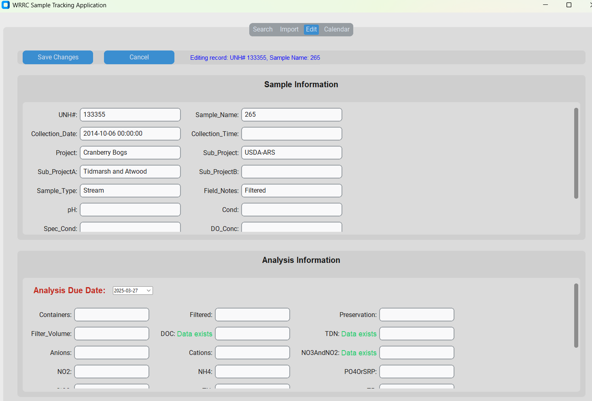

# # Sample Tracker

A Python desktop application for tracking water quality samples and analysis requests for the Water Resources Research Center.



## Features

- **Sample Search**: Quickly find samples by UNH ID or Sample Name
- **Project Search**: Search for samples based on project information
- **Sample Import**: Import sample data from standardized Excel submission forms
- **Record Editing**: Edit sample information and analysis requests
- **Database Integration**: Seamlessly connects to Access database
- **Due Date Tracking**: Set and monitor analysis due dates with calendar view
- **Data Existence Indicators**: Visual indicators showing when measurement data exists for samples

## Screenshots

### Main Interface


### Calendar View for Due Date Tracking


### Sample Editing with Data Tracking


## Installation

### Using the Executable

1. Download the latest release from the [Releases](https://github.com/yourusername/sampletracker/releases) page
2. Extract the ZIP file to a location of your choice
3. Place the Access database file (`wrrc database 110907.accdb`) in the same folder as the executable
4. Run `SampleTracker.exe`

### Requirements for Running the Executable

- Windows 10/11
- Microsoft Access Database Driver (included with most Microsoft Office installations)
- No Python installation needed

### Development Setup

1. Clone the repository:
   ```
   git clone https://github.com/yourusername/sampletracker.git
   ```

2. Create a virtual environment:
   ```
   python -m venv venv
   ```

3. Activate the virtual environment:
   ```
   venv\Scripts\activate
   ```

4. Install dependencies:
   ```
   pip install -r requirements.txt
   ```

5. Run the application:
   ```
   python sampletracking.py
   ```

## Usage

### Searching for Samples

1. Open the "Search" tab
2. Enter a UNH ID or Sample Name in the "Search by Sample" field
3. Click "Search Sample" to find matching records
4. Alternatively, search by project information using the "Search by Project" field

### Importing Sample Data

1. Open the "Import" tab
2. Enter a Project Name (this will be used in the database)
3. Click "Browse" to select a sample submission Excel file
4. Review the data in the preview panes
5. Click "Import Data" to add the samples to the database

### Editing Records

1. Find a record using the search functionality
2. Select the record in the results list
3. Click "Edit Selected" or double-click the record
4. Make changes in the "Edit" tab
5. Click "Save Changes" to update the database

### Due Date Tracking

1. Navigate to the "Calendar" tab to view all samples with due dates
2. Use the month and year dropdowns or navigation buttons to move between months
3. Days with due samples display the UNH# of samples due that day
4. Click on a day to view all samples due on that day in the list below
5. Double-click a sample in the list to open it for editing
6. When editing a sample, set or update its due date using the date picker in the edit form

### Data Existence Indicators

- When editing a sample, green "Data exists" indicators appear next to fields where measurement data exists in the database
- This helps users quickly identify which analyses have been completed
- Indicators are shown for common analysis types like DOC, TDN, Anions, Cations, etc.

## File Format

The application expects Excel files with the following sheets:
- **Project Information**: Contains contact details and project metadata
- **Sample Information**: Contains sample data and analysis requests
- **Chain of Custody**: (Optional) Tracking information

Sample submission templates are available in the `templates` folder.

## Building from Source

To create an executable:

1. Activate your virtual environment
2. Install PyInstaller:
   ```
   pip install pyinstaller
   ```

3. Build the executable using the spec file:
   ```
   pyinstaller sample_tracker.spec
   ```

4. The executable will be created in the `dist` folder

## Troubleshooting

- **Database Connection Issues**: Ensure the Access database file is in the same folder as the executable and that you have the Microsoft Access Database Driver installed
- **Import Errors**: Verify that your Excel file follows the required template format
- **Search Not Returning Results**: Try using partial terms or searching by project instead
- **Calendar Navigation**: If calendar navigation buttons aren't working in the date picker, try using the dropdown selectors instead

## License

This project is licensed under the MIT License - see the [LICENSE](LICENSE) file for details.

## Acknowledgements

- Created for the Water Resources Research Center by Miguel Leon
- Built with [CustomTkinter](https://github.com/TomSchimansky/CustomTkinter)
- Uses [Pandas](https://pandas.pydata.org/) for data processing
- Calendar functionality implemented with [tkcalendar](https://github.com/j4321/tkcalendar)